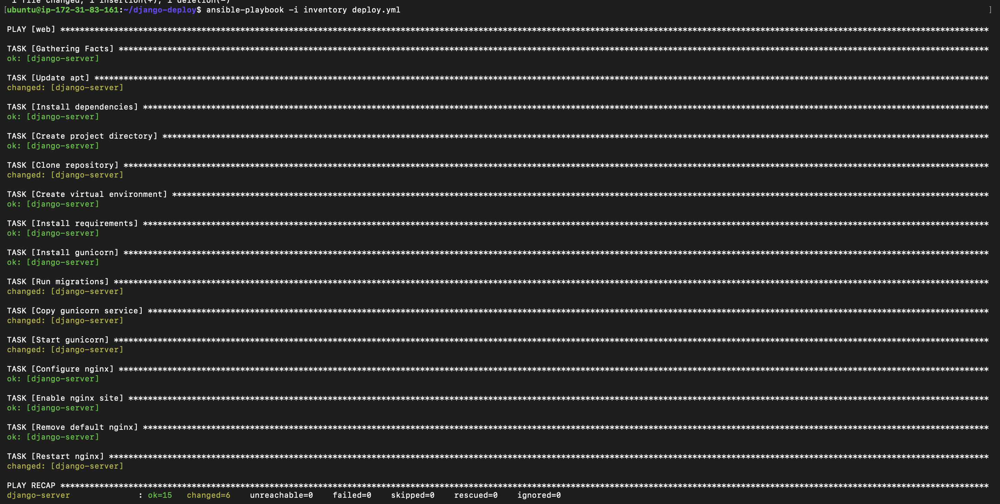
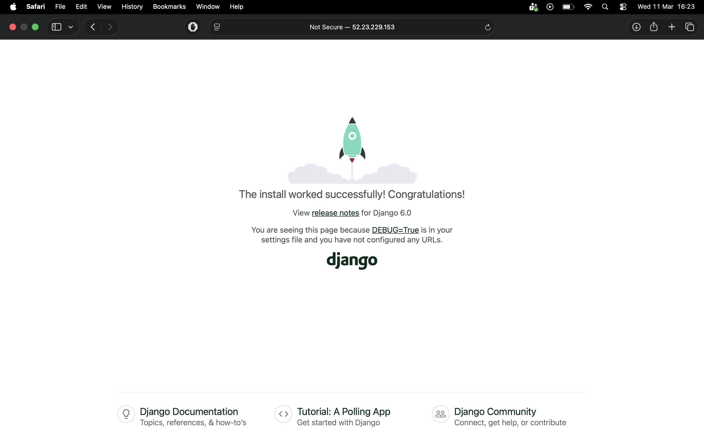

# 1. Architecture

EC2 Instance 1
Ansible Control Server

EC2 Instance 2
Django Application Server

Flow

Control Server → SSH → Django Server → Deploy app

---

# 2. Launch EC2 Instances

Open the Amazon EC2 console.

Create two instances.

### Instance 1 (Control Server)

Name
ansible-controller

Configuration

* OS: Ubuntu 22.04
* Instance type: t2.micro
* Storage: 10 GB
* Security Group

Allow

* SSH (22)

---

### Instance 2 (Django Server)

Name
django-app-server

Configuration

* OS: Ubuntu 22.04
* Instance type: t2.micro

Security group rules

Allow

* SSH (22) from controller
* HTTP (80) from anywhere
* Port 8000 (optional for testing)

---

# 3. Connect to Control Server

SSH into the controller

```bash
ssh -i key.pem ubuntu@CONTROLLER_PUBLIC_IP
```

Update system

```bash
sudo apt update
```

---

# 4. Install Ansible

```bash
sudo apt install ansible -y
```

Verify

```bash
ansible --version
```

---

# 5. Allow SSH from Controller to Django Server

Copy the private key to the controller.

From your laptop:

```bash
scp -i key.pem key.pem ubuntu@CONTROLLER_PUBLIC_IP:/home/ubuntu/
```

Fix permissions

```bash
chmod 400 key.pem
```

Test SSH

```bash
ssh -i key.pem ubuntu@DJANGO_SERVER_IP
```

---

# 6. Create Ansible Project

On the controller instance

```bash
mkdir django-deploy
cd django-deploy
```

Project structure

```text
django-deploy
│
├── inventory
├── deploy.yml
├── group_vars
│   └── web.yml
└── templates
    ├── gunicorn.service.j2
    └── nginx.conf.j2
```

---


# 12. Run Deployment

From the controller

```bash
ansible-playbook -i inventory deploy.yml
```

---

# 13. Access Application

Open browser

```
http://DJANGO_SERVER_PUBLIC_IP
```


Your Django app should load.

---

### Permission issues

Run

```bash
sudo chown -R ubuntu:www-data /var/www/djangoapp
```

---


